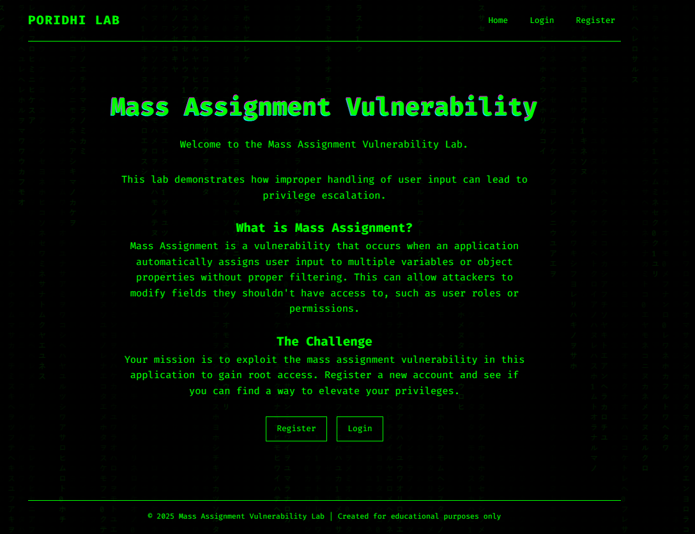
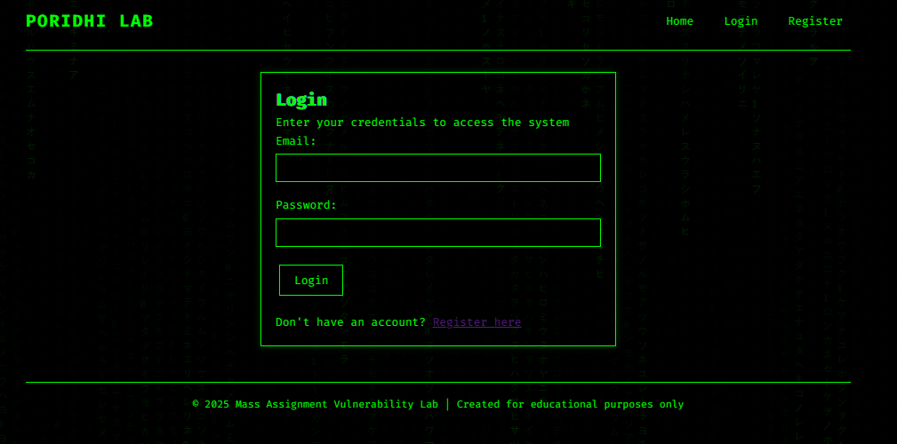
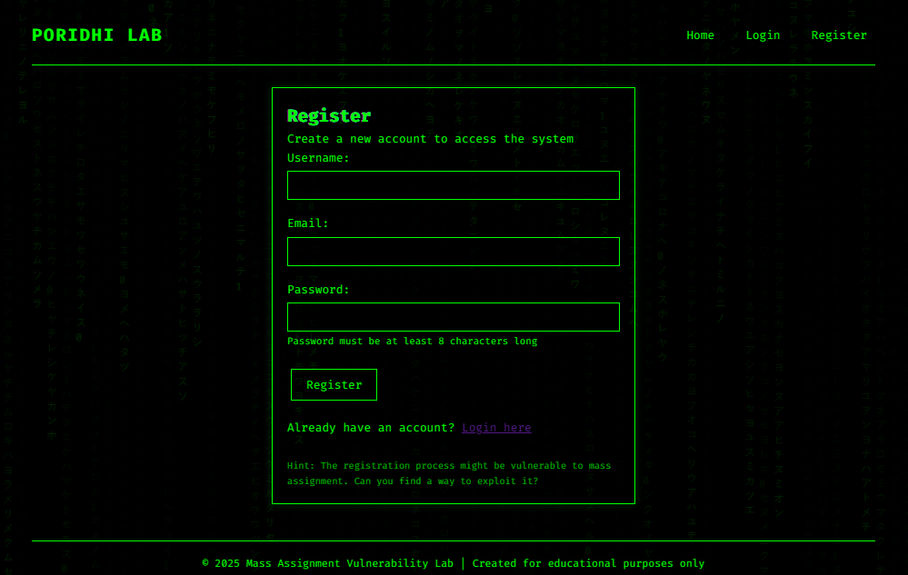
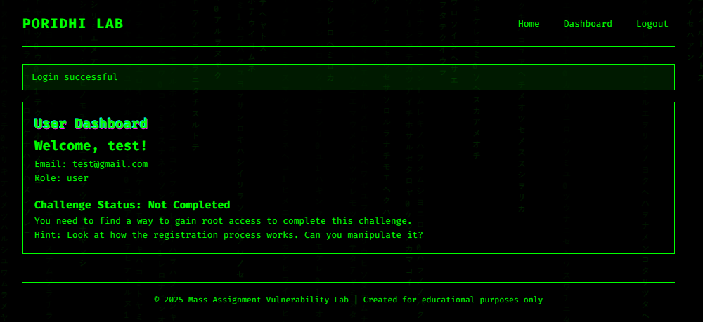

# Mass Assignment Vulnerability Lab

A vulnerable PHP web application that demonstrates a Mass Assignment Vulnerability. This lab is part of the Poridhi security training platform.

## Table of Contents

- [Overview](#overview)
- [Vulnerability Explanation](#vulnerability-explanation)
- [Installation](#installation)
  - [Using Docker (Recommended)](#using-docker-recommended)
  - [Manual Installation](#manual-installation)
- [Usage](#usage)
- [Challenge](#challenge)
- [Solution](#solution)
- [Prevention](#prevention)
- [Screenshots](#screenshots)
- [License](#license)

## Overview

This lab demonstrates a common web application vulnerability called "Mass Assignment" (also known as "Auto-binding" or "Object Injection"). The application is a simple user management system with login and registration functionality, featuring a dark-themed, hacker-style UI with animated effects.

## Vulnerability Explanation

Mass Assignment is a vulnerability that occurs when an application automatically assigns user input to multiple variables or object properties without proper filtering. This can allow attackers to modify fields they shouldn't have access to, such as user roles or permissions.

In this lab, the registration process is vulnerable to mass assignment, allowing attackers to set the `role` field to `root` even though it's not part of the registration form.

## Installation

### Using Docker (Recommended)

The easiest way to run this lab is using Docker and Docker Compose.

1. Clone the repository:
   ```
   git clone https://github.com/your-username/mass_assignment_lab.git
   cd mass_assignment_lab
   ```

2. Build and start the containers:
   ```
   docker-compose up -d
   ```

3. Access the application at http://localhost:8080

### Manual Installation

If you prefer to install the lab manually:

1. Clone the repository to your web server directory:
   ```
   git clone https://github.com/your-username/mass_assignment_lab.git
   ```

2. Create a MySQL database named `mass_assignment`

3. Import the database schema:
   ```
   mysql -u your_username -p mass_assignment < database.sql
   ```

4. Update the database configuration in `config.php` if needed

5. Access the application through your web server

## Usage

1. Visit the home page to learn about the Mass Assignment vulnerability
2. Register a new account using the registration form
3. Login with your credentials
4. Try to exploit the vulnerability to gain root access

## Challenge

Your mission is to exploit the mass assignment vulnerability in this application to gain root access. Register a new account and find a way to elevate your privileges.

## Solution

To solve this challenge, you need to exploit the mass assignment vulnerability in the registration process:

1. Start the registration process by filling out the form normally
2. Use a tool like browser developer tools or a proxy (like Burp Suite) to intercept and modify the request
3. Add an additional parameter `role=root` to the POST request
4. Submit the form
5. Login with your new credentials
6. You'll see the "Lab Solved!" message on the dashboard if you've successfully exploited the vulnerability

### Detailed Solution Steps

1. Open your browser's developer tools (F12 or right-click > Inspect)
2. Go to the Network tab
3. Fill out the registration form with valid information
4. Before submitting, enable request interception in your browser or proxy
5. Submit the form
6. Modify the POST request by adding `&role=root` to the end of the request body
7. Forward the modified request
8. Login with your newly created account
9. You should now have root access and see the success message

## Prevention

To prevent mass assignment vulnerabilities, developers should:

1. Explicitly define which fields are allowed to be set by users (whitelist approach)
2. Never directly insert all POST data into the database without filtering
3. Implement proper access controls for sensitive fields
4. Validate and sanitize all user input
5. Use frameworks that have built-in protection against mass assignment

## Screenshots






## License

This project is licensed under the MIT License - see the LICENSE file for details.

## Disclaimer

This application is for educational purposes only. Do not use the vulnerable code in production environments.
